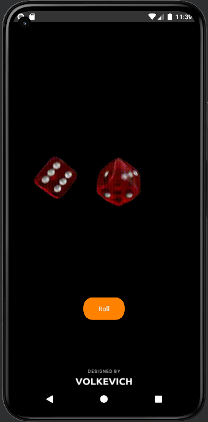
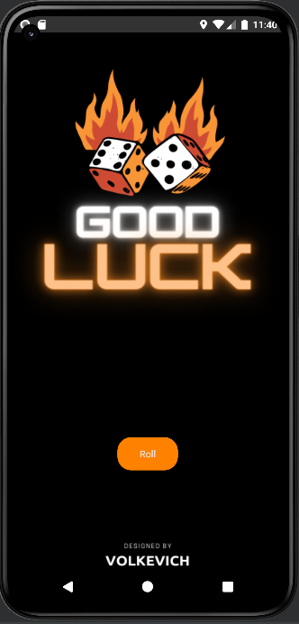

###🎲 Dice app 📱 
###   
___
### This application will help you try your luck in the game of dice by throwing a random dice.
### The interface is very simple, you will need to do:
 - #### Click the button "Roll".

### After pressing the button, a dice with a value that turned out randomly will appear on the screen.

#### Supported android versions :8.0 (Oreo) - API 26 and higher
#### Memory size :minidisc:: 
## Screenshots of the Application:

### Light mode and English:

